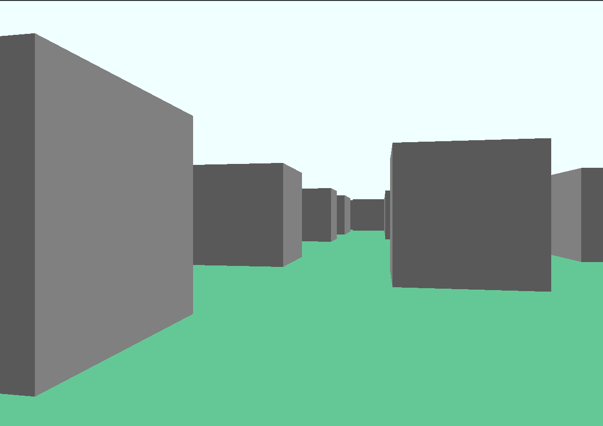

<h1>Escape the Block</h1>

<h2>You do not know who you are, where you are, or how you got here. The only thing you do know, is that the block is out to get you. How long can you stay alive?</h2>
<a href="https://youtu.be/OTLKr69opLA">Demo video</a>

This is a simple game where you maneuver around a randomly generated maze, trying for as long as possible to avoid the block that is following you. The graphics are rendered without a 3d engine, from the bottom up using raycasting. I learn most of the math used from <a href="https://lodev.org/cgtutor/raycasting.html">this article</a> by Lode Vandevenne. All the graphics are rendered using the java swing and java2D frameworks.
The block will always find the shortest path to the player by using a very simple A* algorithm (basically just bfs, with a heuristic to minimize euclidean distance), it also gradually speeds up.

To run the program you will need java 17 or higher and maven installed.